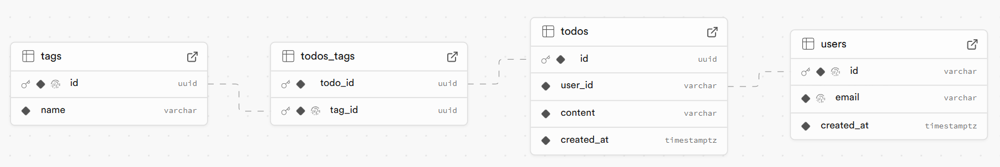

[日本語](./README.md)

# Your personalized todo app

[Try in browser](https://todo-with-tag.vercel.app/)

# What you can do
- Signin/Signup/Signout by email and password
- CRUD(Create/Read/Update/Delete) of todo and tag 
- Tie any tag to each todo
- Search todo by tag

# Getting Started

## Requirement
- Docker Desktop(includes Docker CLI and Docker Compose)

## Setup

**1. Clone the repository**
```bash
git clone https://github.com/clumsy-ug/todo-with-tag.git
cd todo-with-tag
```

**2. Create an .env.local file based on .env.example**
```bash
cp .env.example .env.local
```

**3. Create a project in Supabase**

**4. Add your Supabase credentials to .env.local**
```
NEXT_PUBLIC_SUPABASE_URL=<YOUR_SUPABASE_URL>
NEXT_PUBLIC_SUPABASE_ANON_KEY=<YOUR_SUPABASE_ANON_KEY>
```

**5. (If you use Node.js) Start the development server**
```bash
npm run dev
```

**5. (If you use Docker) Build and run the app with Docker Compose**

> [!TIP]
> If you are using Windows, the heaviness of the process can be improved a little by setting up the project in the **WSL2** environment and launching Docker from there, rather than in the Windows environment.

```bash
docker compose up --build
```

&nbsp;&nbsp;&nbsp;If you want to rebuild dependencies or the entire system, ignoring the cache, you can use
```bash
docker compose up --build --no-cache
```

**6. Open your browser at http://localhost:3000 to view the app.**

# Technical Configuration

## Languages/libraries/frameworks, etc.

| Field          | Technology                                                           |
| -------------  | -------------------------------------------------------------------- |
| Frontend       | TypeScript(5.4.5), React(18.0), Next.js(14.2.10), Tailwind(3.4.1)    |
| Backend        | @supabase/ssr(0.5.1), @supabase/supabase-js(2.45.4)                  |
| Database       | PostgreSQL(15.6)                                                     |
| Infrastructure | Vercel(37.6.0)                                                       |
| Environment    | Node.js(20.14.0) / Docker(27.2.0), Docker Compose(2.28.1)            |

## Database Structure

> [!IMPORTANT]
> Sensitive information such as the actual contents of tables and Supabase API keys will not be shared for security reasons. <br>
Only schema information (table name, column name, type, and description) will be shared.<br>
For actual operation, it is necessary to set up the permissions for each table separately as a Policy in Authentication of Supabase Dashboard.

> [!NOTE]
> PK = Primary Key, FK = Foreign Key.<br>
If a column in one table refers to the primary key of another table, that column is a foreign key.<br>
The arrow in FK represents the referent; FK means influenced (synchronized) by the referent.

### `users` table

| Column Name  | Type        | Description       |
| ------------ | ----------- | ----------------- |
| `id`         | VARCHAR     | User ID (PK)      |
| `email`      | VARCHAR     | Email Address     |
| `created_at` | TIMESTAMPTZ | Registration Date |


### `todos` table

| Column Name  | Type        | Description            |
| ------------ | ----------- | ---------------------- |
| `id`         | UUID        | Todo ID (PK)           |
| `user_id`    | VARCHAR     | User ID (FK->users.id) |
| `content`    | VARCHAR     | Todo Contents          |
| `created_at` | TIMESTAMPTZ | Creation Date          |

### `tags` table

| Column Name | Type    | Description                        |
| ----------- | ------- | ---------------------------------- |
| `id`        | UUID    | Tag ID (PK, FK->todos_tags.tag_id) |
| `name`      | VARCHAR | Tag Name                           |

### `todos_tags` table

| Column Name | Type | Description                |
| ----------- | ---- | -------------------------- |
| `todo_id`   | UUID | Todo ID (PK, FK->todos.id) |
| `tag_id`    | UUID | Tag ID (PK)                |


